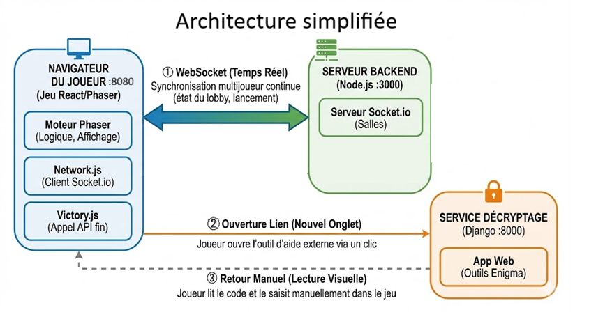

# Terra Numerica - Architecture

## Architecture du Projet

Le projet repose sur une architecture **micro-services** orchestrée par Docker. L'application est divisée en trois conteneurs distincts qui communiquent entre eux :

| Service | Technologie | Port | Rôle |
| :--- | :--- | :--- | :--- |
| **Frontend** | React 19 + Phaser 3 | `8080` | Interface client, rendu du jeu, logique des énigmes. |
| **Backend** | Node.js + Socket.io | `3000` | Gestion multijoueur (Salles/Lobby) et API des scores. |
| **Decryptage** | Django (Python) | `8000` | Application pour les outils de décryptage (Enigma, Fréquences). |

---

## Détail des Services

### A. Frontend (`/frontend`)
Le coeur de l'expérience utilisateur. C'est une **Single Page Application** construite avec **Vite**.

* **Intégration React & Phaser :**
    * **React (`App.jsx`, `PhaserGame.jsx`)** : Sert de conteneur ("wrapper"). Il initialise le moteur de jeu Phaser et gère le cycle de vie du Canvas.
    * **Phaser (`src/game/`)** : Gère toute la logique ludique, les scènes, les interactions et l'inventaire.

* **Architecture du Jeu Phaser :**
    * **`main.js`** : Point d'entrée de la configuration du jeu (physique, scènes, dimensions).
    * **`GameData.js`** : "Base de données" statique côté client. Contient la définition de toutes les cartes, les solutions des énigmes, les liens entre les objets et les pénalités.
    * **`GameState.js`** : Singleton qui stocke l'état courant (Inventaire du joueur, indices débloqués, cartes retournées).
    * **`EventBus.js`** : Système de communication découplé. Permet d'envoyer des messages entre les scènes Phaser et les composants React (ex: afficher une notification React quand une carte est trouvée).

* **Scènes Clés :**
    * **`Game.js`** : La scène principale (HUD, Inventaire, Chronomètre).
    * **`CardScene.js`** : Scène qui gère l'affichage d'une carte unique et instancie les mini-jeux HTML/DOM (Digicodes, Cadenas, Terminal, César) par-dessus le Canvas.
    * **`Lobby.js`** : Gère l'attente des joueurs en mode multijoueur.

### B. Backend (`/backend`)
Le serveur central pour la persistance et la synchronisation.

* **API REST (Express) :**
    * Sert les données de score (lecture/écriture dans `data/scores.json`).
* **Temps réel (Socket.io) :**
    * **`server.js`** : Gère les événements WebSocket (`connection`, `create-room`, `join-room`, `player-ready`).
    * Synchronise l'état de démarrage du jeu entre plusieurs clients connectés à la même room.

### C. Décryptage (`/decryptage`)
Un service web autonome basé sur **Django** qui fournit des interfaces complexes pour certaines énigmes.

* **Modules Django :**
    * **`analyseFreq`** : Outil interactif pour casser des codes par analyse de fréquence.
    * **`enigma`** : Simulateur ou outil lié à la machine Enigma.
* **Base de Données** : Utilise SQLite (`db.sqlite3`) pour stocker les données nécessaires à ces mini-applications.
* **Interaction** : Le joueur est redirigé vers ce service (port 8000) via des liens présents sur certaines cartes du jeu (ex: Carte 22).

---

## Flux de données

1.  **Démarrage** : Le joueur charge le Frontend (8080).
2.  **Multijoueur** : Le Frontend se connecte au Backend (3000) via WebSockets.
    * *Event:* `join-room` -> Le serveur valide et ajoute le joueur.
3.  **Gameplay** :
    * Le joueur clique sur une carte.
    * `UISearchManager.js` vérifie dans `GameData.js` si la carte existe.
    * Si c'est une énigme complexe (ex: Carte 83), `CardScene.js` affiche l'interface.
4.  **Outils Externes** :
    * Pour décrypter un message, le joueur ouvre un lien vers le service Django (8000).
    * Une fois le code trouvé (ex: "TERMINUS"), il revient sur le jeu (8080) pour le saisir.
5.  **Fin de partie** :
    * Le score est envoyé via une requête POST au Backend (3000) pour être sauvegardé.

---

## Arborescence des fichiers

```bash
sae-terra-numerica/
├── docker-compose.yaml       # Orchestration des 3 services
├── package.json              # Scripts globaux
│
├── 📂 backend/               # SERVICE BACKEND (Node.js)
│   ├── Dockerfile
│   ├── server.js             # Serveur Express + Socket.io
│   └── package.json
│
├── 📂 data/
│   └── scores.json           # Persistance des scores (Partagé)
│
├── 📂 decryptage/            # SERVICE DÉCRYPTAGE (Django)
│   ├── Dockerfile
│   ├── manage.py
│   ├── db.sqlite3
│   ├── analyseFreq/          # App Django: Analyse Fréquentielle
│   │   ├── models.py
│   │   ├── views.py
│   │   └── templates/
│   ├── decryptage/           # Config Django globale
│   │   ├── settings.py
│   │   └── urls.py
│   └── enigma/               # App Django: Enigma
│       ├── models.py
│       └── views.py
│
└── 📂 frontend/              # SERVICE FRONTEND (React + Phaser)
    ├── Dockerfile
    ├── index.html
    ├── vite.config.js
    ├── public/               # Assets statiques (Images cartes, Sons)
    │   └── assets/
    └── src/
        ├── main.jsx          # Point d'entrée React
        ├── App.jsx           # Composant Racine
        ├── PhaserGame.jsx    # Composant Conteneur du Jeu
        └── game/             # LOGIQUE DU JEU PHASER
            ├── main.js       # Config Phaser
            ├── EventBus.js   # Bus d'événements
            ├── GameData.js   # Données statiques (Cartes/Énigmes)
            ├── GameState.js  # État dynamique (Inventaire)
            ├── Network.js    # Client Socket.io
            └── scenes/       # SCÈNES DU JEU
                ├── Boot.js
                ├── Preloader.js      # Chargement Assets
                ├── MainMenu.js        # Menu principal
                ├── MultiplayerMenu.js # Menu mutijoueur
                ├── Lobby.js          # Salle d'attente
                ├── Briefing.js       # Onglet briefing mission
                ├── Game.js           # Gameplay principal
                ├── CardScene.js      # Zoom Carte & Puzzles
                ├── UISearchManager.js # Barre de recherche
                ├── Victory.js          # Ecran victoire
                └── GameOver.js         # Ecran défaite
```

